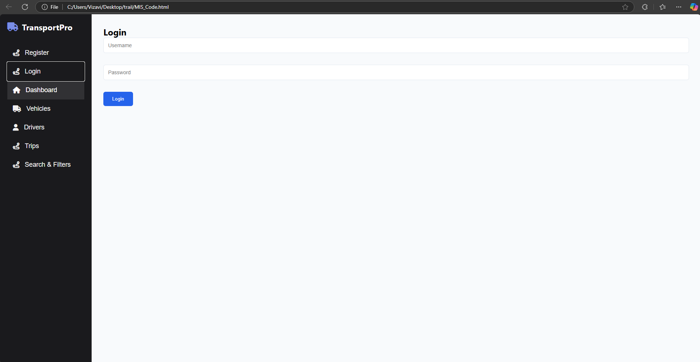

# TransportPro
**TransportPro** is a web-based fleet management system for tracking vehicles, managing drivers, scheduling trips, and monitoring fleet performance. 

TransportPro - Fleet Management System
TransportPro is a web-based fleet management system designed to streamline vehicle and trip management for logistics and transport companies. It provides an intuitive dashboard to monitor fleet performance, manage drivers, schedule trips, and track vehicle statuses.

Key Features:
User Authentication: Secure login and registration system.
Dashboard Overview: Real-time statistics on vehicles, drivers, and trips.
Vehicle Management: Add, edit, and delete vehicles with license tracking.
Driver Management: Maintain driver records, including licenses and contact details.
Trip Scheduling: Assign vehicles and drivers to trips with route and time management.
Status Updates: Track trip statuses (Scheduled, Completed, or Cancelled).
Search & Filters: Quickly find trips based on assigned drivers and vehicles.
Reports & Analytics: Visualize trip statistics with interactive charts.
Built using HTML, CSS, and JavaScript, TransportPro leverages session storage for data handling and includes responsive design for seamless use on various devices.

